# 🛒 AI-Powered E-commerce Automation Agent

> A production-grade, cloud-native **microservices e-commerce platform** with a built-in **AI Shopping Agent** powered by **Anthropic Claude**. Users can search products, manage carts, place orders, and pay — all through natural language conversation.

---

## 📌 Table of Contents

- [Overview](#-overview)
- [System Architecture](#-system-architecture)
- [Microservices Breakdown](#-microservices-breakdown)
- [AI Agent — How It Works](#-ai-agent--how-it-works)
- [Tech Stack](#-tech-stack)
- [API Reference](#-api-reference)
- [Getting Started](#-getting-started)
- [Environment Variables](#-environment-variables)
- [What Can Be Improved](#-what-can-be-improved)
- [Author](#-author)

---

## 🧠 Overview

Most e-commerce platforms require users to navigate menus, filter products, and fill forms manually. This project removes all that friction.

A user simply types:

> _"Buy me a black iPhone 16 Pro, 256GB, and use my home address"_

The AI Agent autonomously:

1. Searches for the product
2. Finds the correct variant (black, 256GB)
3. Checks stock availability
4. Asks for confirmation
5. Places the order
6. Initiates payment via Razorpay

All through a single chat API call — no UI needed. The backend is a full microservices ecosystem with service discovery, a JWT-secured API gateway, Kafka-driven async events, Redis session caching, and Resilience4j circuit breakers.

---

## 🏗 System Architecture

```
               ┌───────────────────────────────────┐
               │  Client (Mobile / Web / Postman)  │
               └───────────────────────────────────┘
                                  │
                                  ▼
                         ┌─────────────────┐
                         │   API Gateway   │  ← JWT Validation + Routing (port 8080)
                         └────────┬────────┘
                                  │  
                                  │ Routes to downstream services via Eureka (lb://)
                                  │
                                  ▼
    ┌───────────┬───────────┬────────────┬──────────┬───────────┐
    ▼           ▼           ▼            ▼          ▼           ▼
   User       Product      Cart        Order      Payment      Agent
   Service    Service      Service     Service    Service      Service
    │
    ▼
    JWT issued here → propagated to all services via gateway headers


┌------------------------------------------------------------------┐
│                   Apache Kafka (Async Events)                    │
│                                                                  │
│ Payment ────────────────────► Order Service (status updated)     │
│ Order   ────────────────────► Product Service  (stock deduction) │
│                                                                  │
└------------------------------------------------------------------┘
         
             
┌--------------------------------------------------------------┐
│                           Redis                              │
│                                                              │
│ Agent Service ◄──────────────────────► Session Context Cache │                                       │
│                                                              │
└--------------------------------------------------------------┘


┌--------------------------------------------------------------┐
│                   PostgreSQL (per service)                   │
│                                                              │
│ userdb │ productdb │ cartdb │ orderdb │ paymentdb │ agentdb  │                                       │
│                                                              │
└--------------------------------------------------------------┘ 
```

**Service Discovery**: All services register with **Netflix Eureka** (port 8761). The API Gateway resolves services by name using load-balanced Feign calls.

---

## 📦 Microservices Breakdown

### 1. 🔍 Discovery Server

- **Tech**: Spring Cloud Netflix Eureka Server
- **Port**: `8761`
- **Role**: Central service registry. All microservices register here. API Gateway resolves `lb://SERVICE-NAME` URIs dynamically.

---

### 2. 🚪 API Gateway

- **Tech**: Spring Cloud Gateway, JWT (JJWT 0.12.6)
- **Port**: `8080`
- **Role**: Single entry point for all client traffic. Validates JWT tokens on every request via a custom `AuthenticationFilter`. Routes requests to downstream services.

| Route Prefix          | Forwarded To    |
| --------------------- | --------------- |
| `/api/v1/agent/**`    | Agent Service   |
| `/api/v1/users/**`    | User Service    |
| `/api/v1/products/**` | Product Service |
| `/api/v1/cart/**`     | Cart Service    |
| `/api/v1/orders/**`   | Order Service   |
| `/api/v1/payments/**` | Payment Service |

---

### 3. 👤 User Service

- **Tech**: Spring Boot, Spring Security, JWT, PostgreSQL
- **Role**: Handles user registration, login, JWT issuance, and address management.
- **Key features**:
    - Password hashing with BCrypt
    - JWT generation with configurable secret key
    - Address CRUD for delivery addresses
    - Custom JWT security filter chain

---

### 4. 📦 Product Service

- **Tech**: Spring Boot, Spring Security, JPA, PostgreSQL, Kafka Consumer
- **Role**: Product catalog management. Supports products, variants (size/color/SKU), and images.
- **Key entities**: `Product`, `ProductVariant`, `ProductImage`
- **Kafka Consumer**: Listens to order events to **deduct stock** on confirmed orders.
- **Feign calls**: Consumed by Agent, Cart, and Order services.

---

### 5. 🛒 Cart Service

- **Tech**: Spring Boot, JPA, PostgreSQL, OpenFeign, Resilience4j
- **Role**: Manages user shopping carts. Validates product/variant existence via Feign calls to Product Service with circuit breaker protection.
- **Key operations**: Add item, view cart, clear cart

---

### 6. 📋 Order Service

- **Tech**: Spring Boot, JPA, PostgreSQL, Kafka Producer/Consumer, OpenFeign, Resilience4j
- **Role**: Places orders from cart or directly (buy-now). Verifies stock with Product Service. Publishes `OrderPlacedEvent` to Kafka for async processing.
- **Circuit Breaker**: `product-service-call` with 50% failure threshold, 30s open state.
- **Kafka Topics**: Produces order events consumed by Product and Payment services.

---

### 7. 💳 Payment Service

- **Tech**: Spring Boot, Razorpay Java SDK, JPA, PostgreSQL, Kafka Producer, Resilience4j
- **Role**: Integrates with Razorpay to create payment orders and verify webhook signatures. Publishes payment events back to Order Service.
- **Key classes**: `PaymentPage.java` (creates Razorpay order), `VerifySignature.java` (validates webhook)
- **Circuit Breaker**: `order-service-call` with retry support.

---

### 8. 🤖 Agent Service _(The Star of the Show)_

- **Tech**: Spring Boot, Anthropic Claude API, Redis, PostgreSQL, OpenFeign, Resilience4j, Kafka
- **Role**: The conversational AI layer. Accepts user messages, orchestrates Claude API calls in a **tool-use loop**, executes microservice actions, and returns friendly responses.

> See the [AI Agent section](#-ai-agent--how-it-works) below for deep dive.

---

## 🤖 AI Agent — How It Works

The Agent Service implements an **agentic loop** pattern with Anthropic Claude as the reasoning engine.

### Flow Diagram

```
                      User message
                          │
                          ▼
      Resolve/Create Session (PostgreSQL + Redis)
                          │
                          ▼
    Append message to conversation history (Redis)
                          │
                          ▼
          ┌────────────────────────────────┐
          │       LLM Orchestration Loop   │  (max 10 iterations)
          │                                │
          │  Call Claude API               │
          │        │                       │
          │  stop_reason = end_turn?    ──►   Final Response → return to user
          │        │                       │
          │  stop_reason = tool_use?    ──►   Execute tool against microservice
          │        │                       │  → append result → loop again
          │  stop_reason = pause_turn?  ──►   Ask user for clarification
          │                                │
          └────────────────────────────────┘
                          │
                          ▼
          Save conversation to PostgreSQL
          Update Redis session context

Return ChatResponse with action summaries + quick replies
```

### Available Tools (Claude can call these autonomously)

| Tool                | Description                                  |
| ------------------- | -------------------------------------------- |
| `searchProducts`    | Search catalog by name or category           |
| `getProductDetails` | Fetch product info, variants, images         |
| `getVariantInfo`    | Check stock and price for a specific variant |
| `getCart`           | View the user's current cart                 |
| `addToCart`         | Add a specific product variant to cart       |
| `clearCart`         | Empty the cart                               |
| `buyNow`            | Single-item immediate order (skips cart)     |
| `placeOrder`        | Place order from all cart items              |
| `getOrder`          | Fetch status of a specific order             |
| `getMyOrders`       | List all user orders                         |
| `initiatePayment`   | Create a Razorpay payment link for an order  |
| `getAllAddresses`   | Fetch user's saved delivery addresses        |

### Session Management

| Layer          | What's stored                                                                       |
| -------------- | ----------------------------------------------------------------------------------- |
| **Redis**      | Active conversation history, last product/variant/order IDs, clarification state    |
| **PostgreSQL** | Full message history, agent actions with status (SUCCESS/FAILURE), session metadata |

- If Redis cache expires, the Agent **rebuilds context from PostgreSQL** seamlessly.
- Sessions have statuses: `ACTIVE`, `CLARIFYING`, `COMPLETED`.
- `CLARIFYING` state triggers quick replies like `["Yes, confirm order", "No cancel"]`.

### Resilience

- Claude API: 2 retries with 2s backoff
- Microservice Feign calls: 3 retries with 500ms backoff
- Circuit Breaker: 50% failure threshold, 30s open window

---

## 🎬 Agent in Action — End-to-End Demo

> A real Postman walkthrough showing one complete shopping session powered by the Claude tool-use loop. All 15 steps run through a single `POST /api/v1/agent/chat` endpoint — no UI, just conversational AI orchestrating microservices autonomously.
 
---

### Step 1 — Session Initiated, Agent Greets the User
> **User:** "Hey, How are you, I'm your customer."  
> Claude responds naturally and presents its capabilities. No tools called — pure LLM response. Session created in Redis + PostgreSQL.

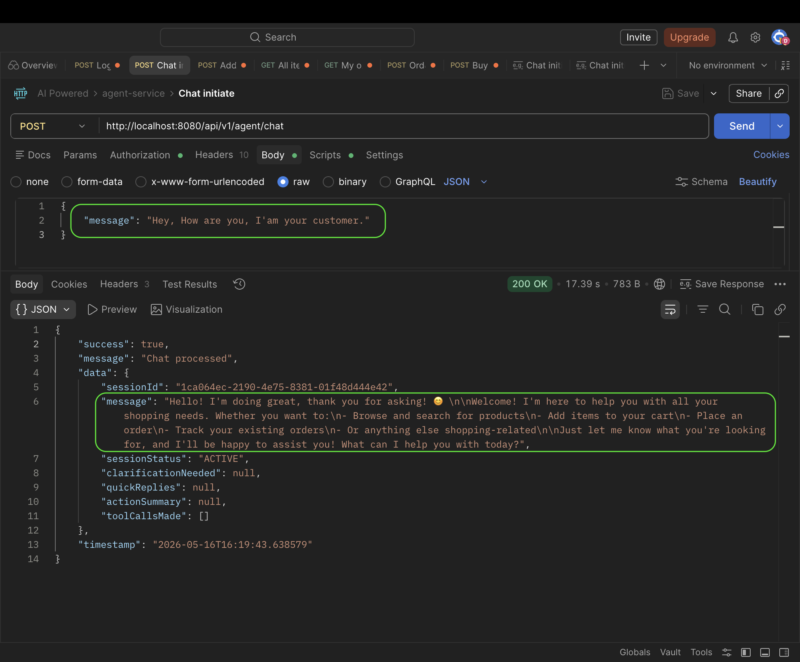
 
---

### Step 2 — Agent Calls `searchProducts` (Boat Speaker)
> **User:** "Yeah, I want to add the Bluetooth speaker of Boat into my cart."  
> Claude calls `searchProducts` → no Boat brand found → honestly tells the user, suggests JBL alternatives with variants and stock.  
> **Tool:** `searchProducts` ✅

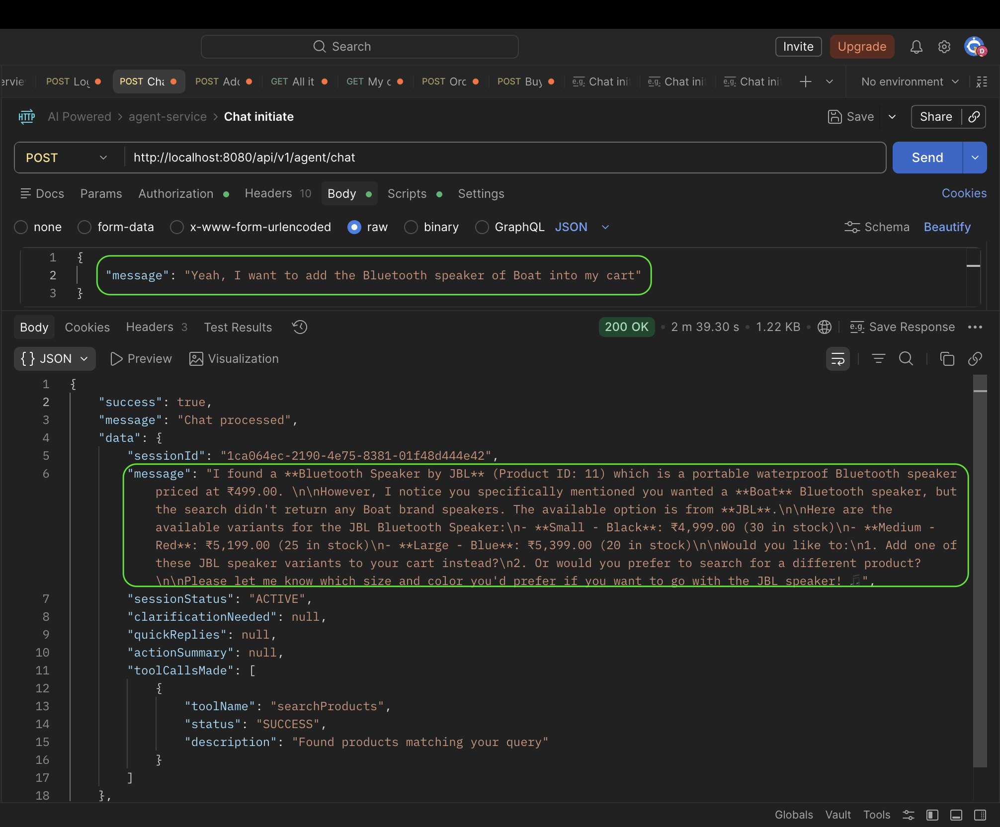
 
---

### Step 3 — `addToCart` Fails — Agent Handles Gracefully
> **User:** "Add JBL speaker of color black in my cart."  
> Claude calls `addToCart` → tool returns FAILED → agent doesn't crash. It explains the issue and offers alternatives (retry, buy now, check cart).  
> **Tool:** `addToCart` ❌ — Resilience in action

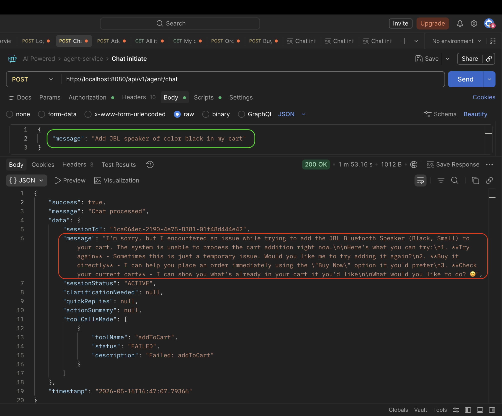
 
---

### Step 4 — User Retries, `addToCart` Succeeds
> **User:** "Add JBL speaker of color black in my cart, try again."  
> Claude retries `addToCart` → SUCCESS. Returns cart summary with item, price, and next action suggestions.  
> **Tool:** `addToCart` ✅ | **actionSummary:** `ADD_TO_CART`

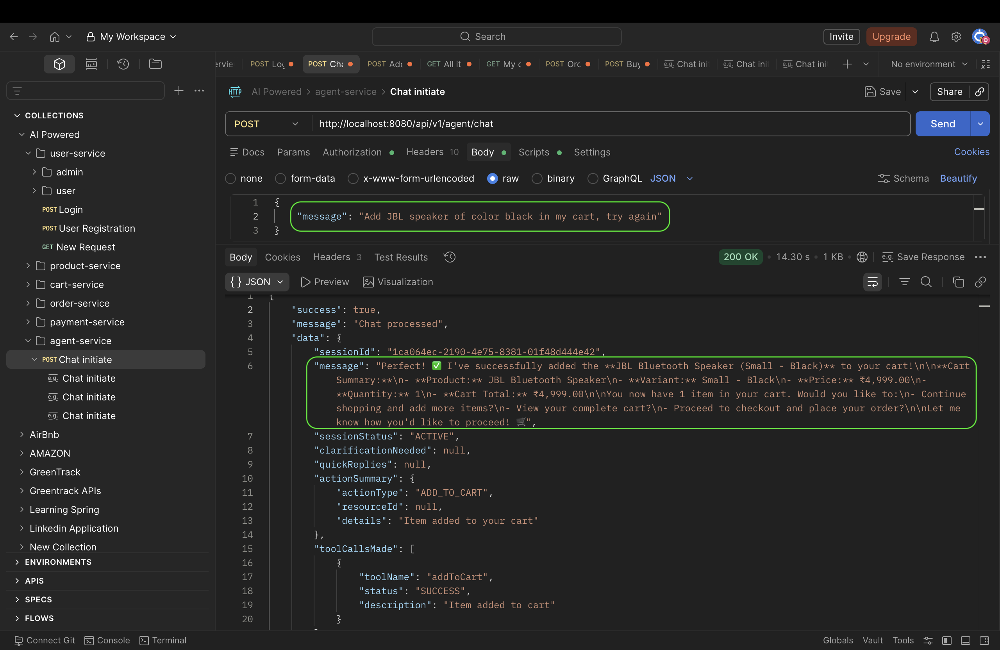
 
---

### Step 5 — Agent Calls `searchProducts` (Men's Wallet)
> **User:** "Now I want men wallet as well, can you add this into my cart."  
> Claude calls `searchProducts` → finds Fossil Leather Wallet → returns variants with stock status (in stock ✅, low stock ⚠️, out of stock ❌).  
> **Tool:** `searchProducts` ✅

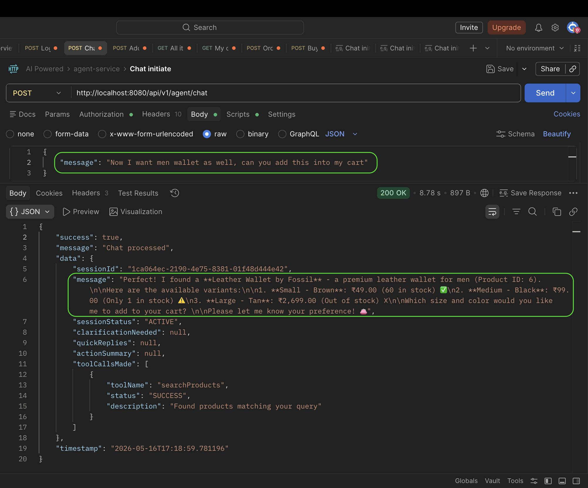
 
---

### Step 6 — `addToCart` + Cart Summary in One Turn
> **User:** "Add brown and show me the cart details."  
> Claude calls `addToCart` for wallet (Small - Brown) → then returns full cart: 2 items, ₹5,048.00 total.  
> **Tool:** `addToCart` ✅ | **actionSummary:** `ADD_TO_CART`

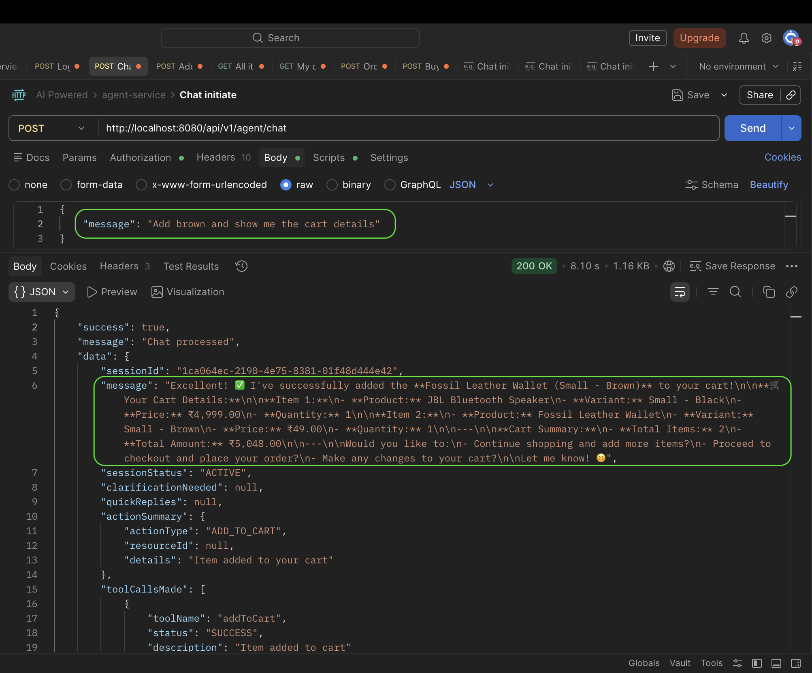
 
---

### Step 7 — Checkout Triggers `getAllAddresses` Tool Call
> **User:** "Now please proceed and checkout."  
> Claude autonomously calls `getAllAddresses` → fetches saved delivery addresses → asks user to confirm which one to use before placing the order.  
> **Tool:** `getAllAddresses` ✅

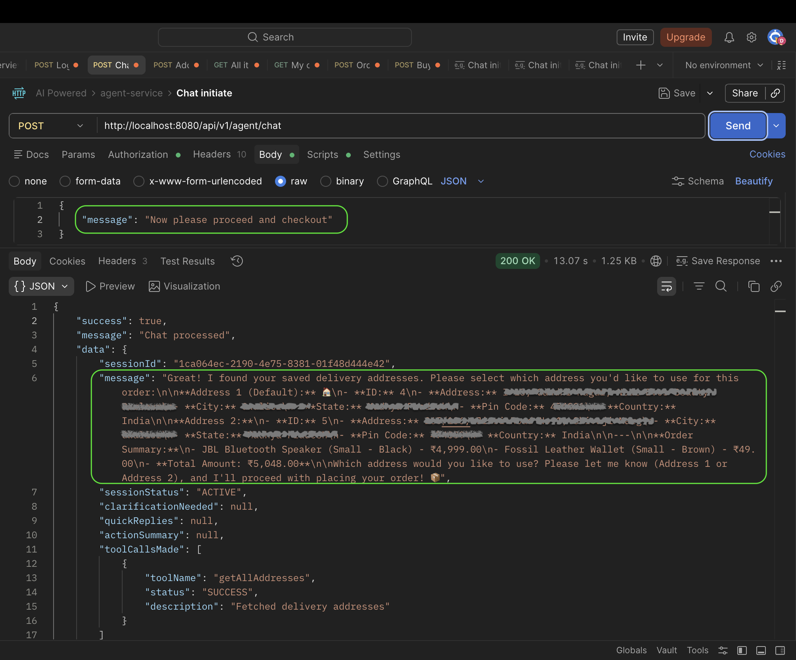
 
---

### Step 8 — `placeOrder` Succeeds — Order #32 Created
> **User:** "Go with default address."  
> Claude calls `placeOrder` with the default address → Order #32 placed, status PENDING (Payment Required). Prompts user to initiate payment.  
> **Tool:** `placeOrder` ✅ | **actionSummary:** `ORDER_PLACED`

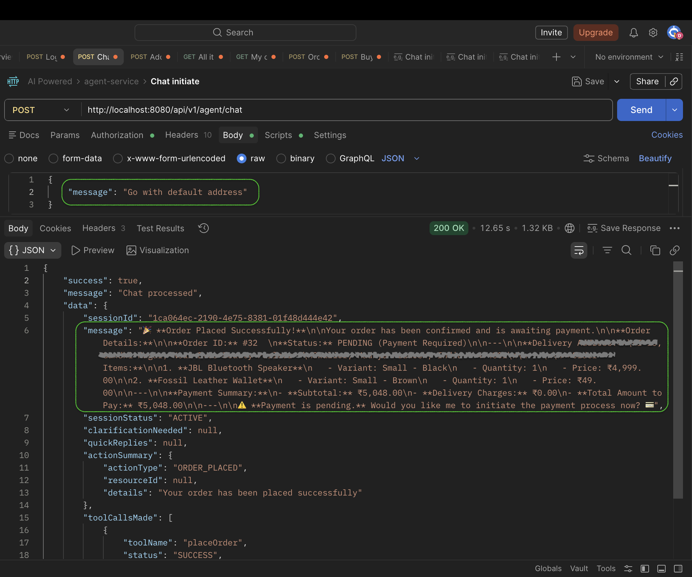
 
---

### Step 9 — `initiatePayment` Fails — Circuit Breaker Triggered
> **User:** "Yes proceed with payment."  
> Claude calls `initiatePayment` → payment service temporarily unavailable → agent informs user, reassures order is saved, offers retry options.  
> **Tool:** `initiatePayment` ❌ — Circuit Breaker triggered

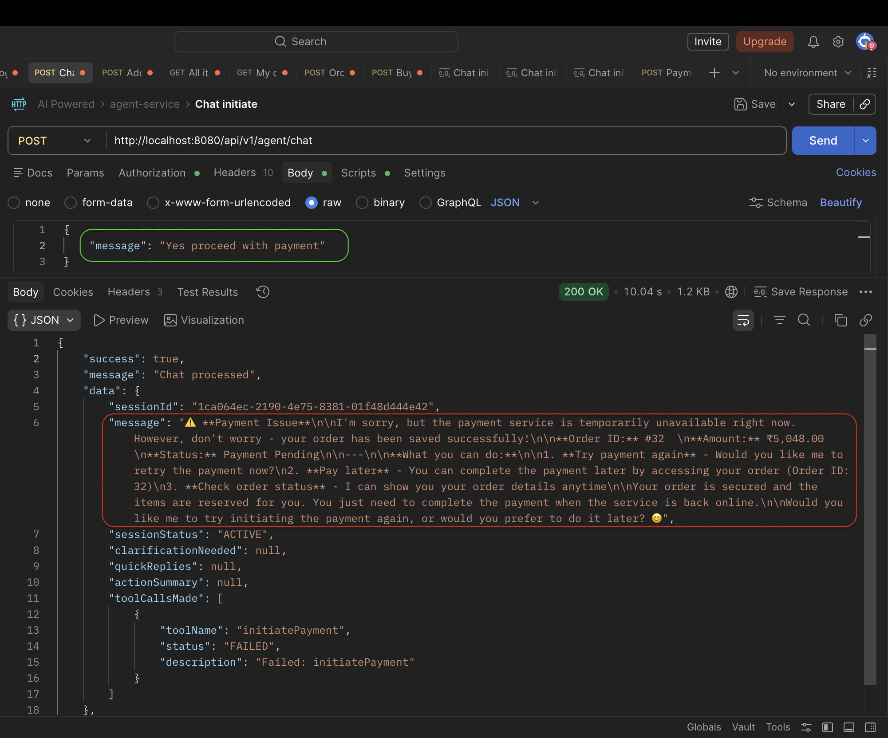
 
---

### Step 10 — Retry Still Fails — Agent Stays Calm
> **User:** "Yes proceed with payment, try again."  
> Second attempt also fails → agent keeps the user informed, confirms order is safe and items are reserved, suggests trying later.  
> **Tool:** `initiatePayment` ❌

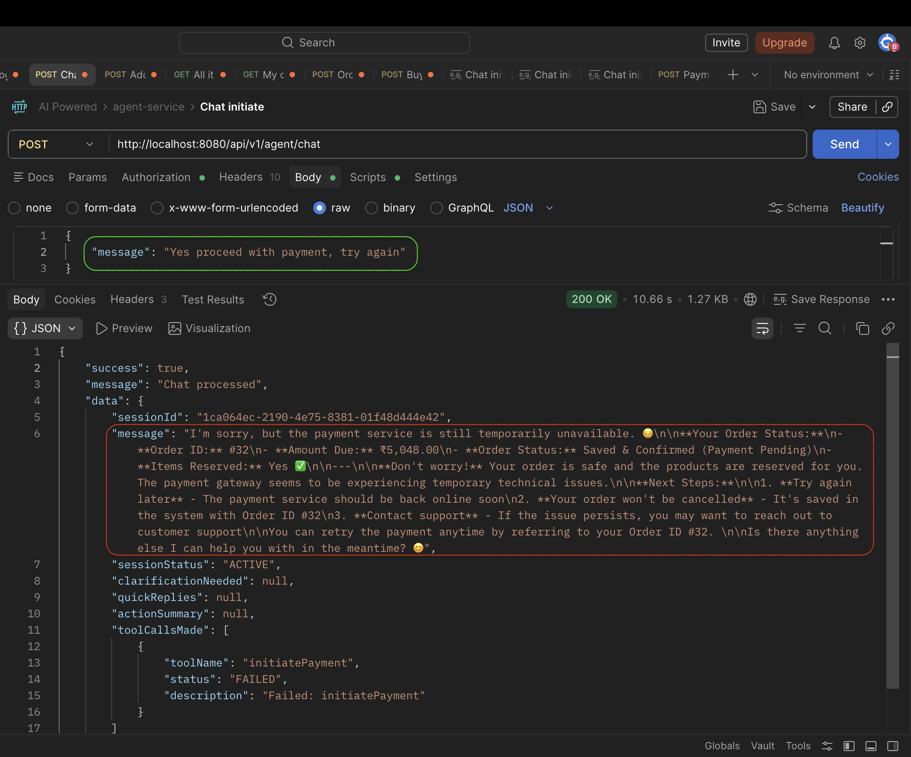
 
---

### Step 11 — User Checks Pending Orders via `getMyOrders`
> **User:** "Wait show my pending orders."  
> Claude calls `getMyOrders` → returns all PENDING orders with amounts and dates. Order #32 appears at the top.  
> **Tool:** `getMyOrders` ✅

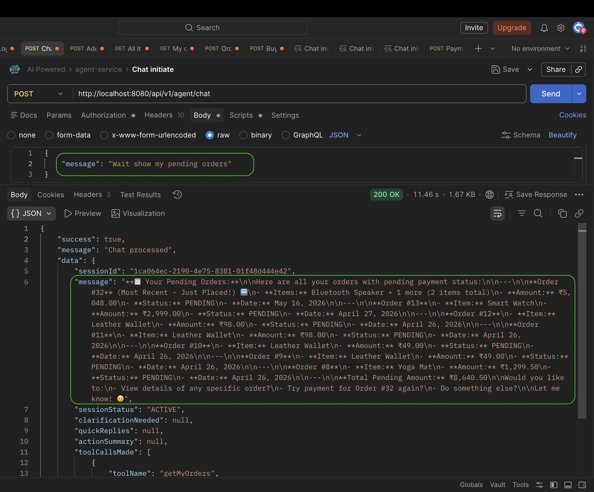
 
---

### Step 12 — `initiatePayment` Succeeds — Razorpay Link Generated
> **User:** "Can you please proceed payment for recent order."  
> Claude calls `initiatePayment` for Order #32 → SUCCESS. Returns Razorpay Payment ID, Gateway Order ID, and payment URL.  
> **Tool:** `initiatePayment` ✅ | **actionSummary:** `PAYMENT_INITIATED`

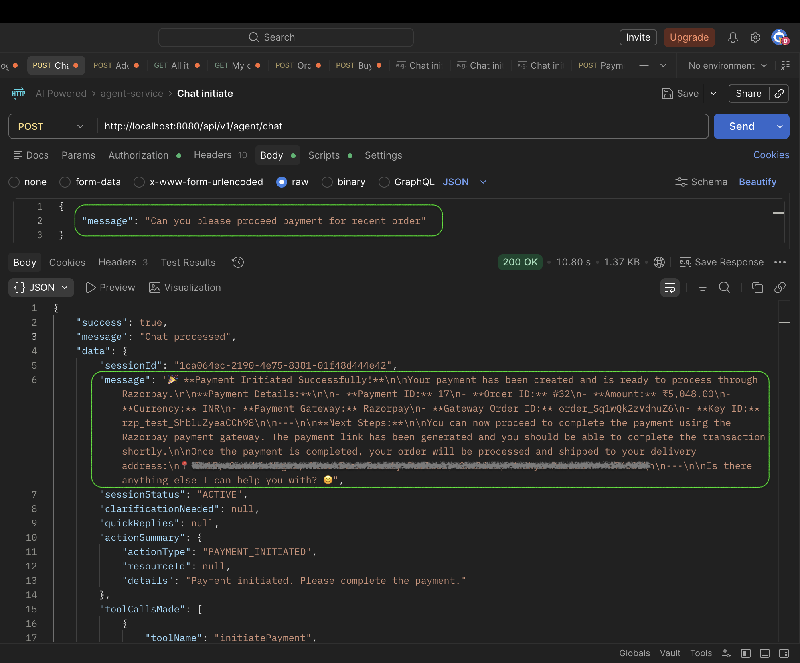
 
---

### Step 13 — Razorpay Payment Page Opens
> Agent-generated payment link opens in the browser. Shows Order ID: 32, Amount: ₹5,048.00, and a "Pay Now" button.

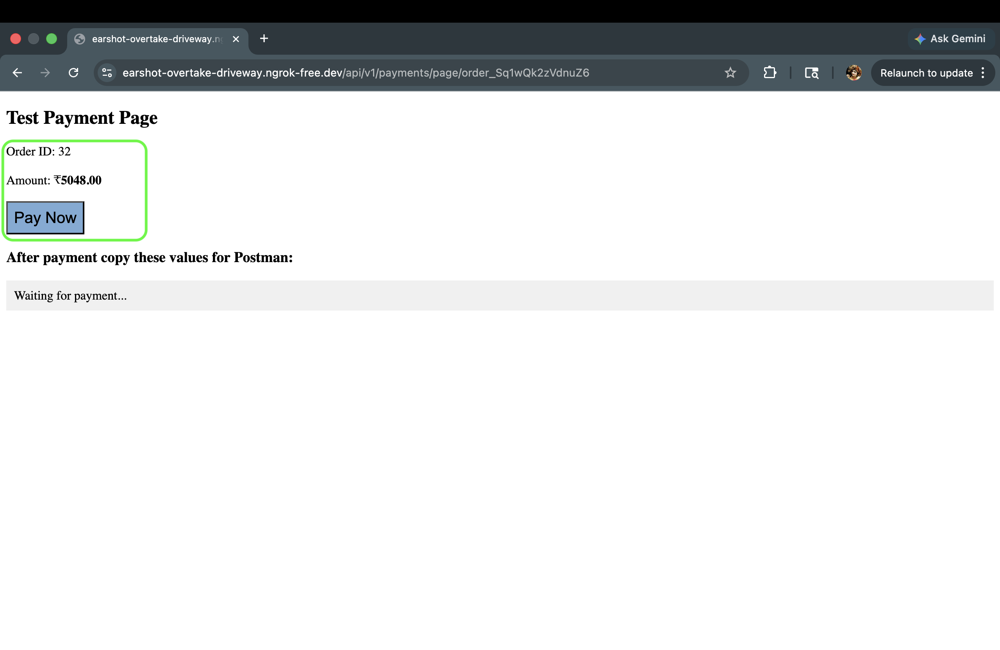
 
---

### Step 14 — Razorpay Checkout Modal (Test Mode)
> Razorpay's native checkout UI opens with UPI, Cards, EMI, and Netbanking options. Test card used to simulate payment — OTP being sent.

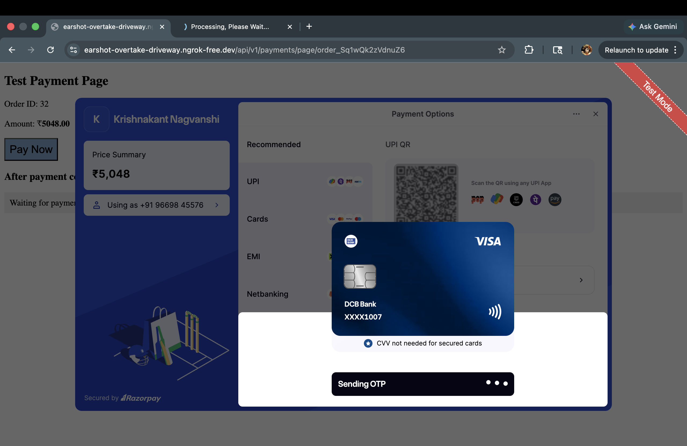
 
---

### Step 15 — Order Confirmed ✅
> **User:** "Now show me confirmed orders."  
> Claude calls `getMyOrders` → Order #32 status is now **CONFIRMED** 🎉. Full order breakdown with delivery address and items shown.  
> **Tool:** `getMyOrders` ✅

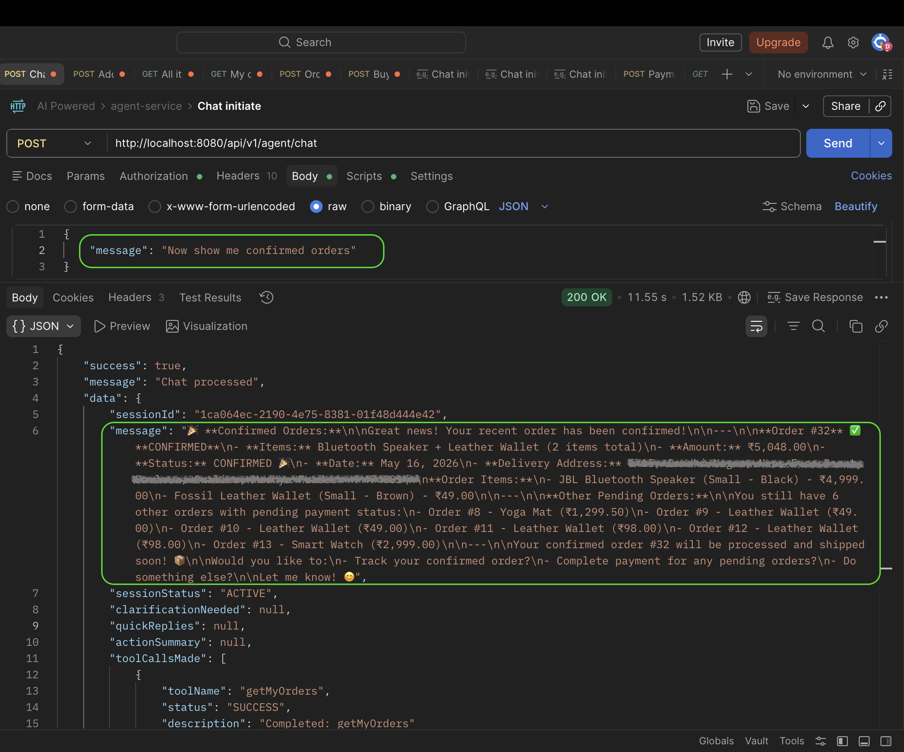
 
---

## 🛠 Tech Stack

| Category                | Technology                             |
| ----------------------- | -------------------------------------- |
| **Language**            | Java 21                                |
| **Framework**           | Spring Boot 3.5.x                      |
| **Cloud**               | Spring Cloud 2025.0.2                  |
| **AI / LLM**            | Anthropic Claude (claude-3 series)     |
| **Service Discovery**   | Netflix Eureka                         |
| **API Gateway**         | Spring Cloud Gateway                   |
| **Auth**                | JWT (JJWT 0.12.6)                      |
| **Inter-service calls** | OpenFeign                              |
| **Async Messaging**     | Apache Kafka                           |
| **Cache**               | Redis (Spring Data Redis)              |
| **Database**            | PostgreSQL (per-service)               |
| **Resilience**          | Resilience4j (Circuit Breaker + Retry) |
| **Payment**             | Razorpay Java SDK                      |
| **ORM**                 | Spring Data JPA / Hibernate            |
| **Validation**          | Spring Boot Validation (JSR-380)       |
| **Mapping**             | ModelMapper 3.2.4                      |
| **Boilerplate**         | Lombok                                 |
| **Build**               | Maven                                  |

---

## 📡 API Reference

All requests go through the API Gateway at `http://localhost:8080`.  
Most endpoints require a JWT Bearer token: `Authorization: Bearer <token>`

### Auth (User Service)

```
POST /api/v1/users/auth/register    → Register a new user
POST /api/v1/users/auth/login       → Login, returns JWT token
```

### Products

```
GET  /api/v1/products               → List all products
GET  /api/v1/products/{id}          → Get product by ID
GET  /api/v1/products/search?q=...  → Search products
POST /api/v1/admin/products         → Create product (admin)
```

### Cart

```
GET    /api/v1/cart                 → View cart
POST   /api/v1/cart/add             → Add item to cart
DELETE /api/v1/cart/clear           → Clear cart
```

### Orders

```
POST /api/v1/orders/place           → Place order from cart
POST /api/v1/orders/buy-now         → Buy single item directly
GET  /api/v1/orders/{id}            → Get order details
GET  /api/v1/orders/my              → Get all my orders
```

### Payments

```
POST /api/v1/payments/initiate      → Create Razorpay payment order
POST /api/v1/payments/verify        → Verify payment signature (webhook)
```

### AI Agent ⭐

```
POST /api/v1/agent/chat
Body: {
  "sessionId": "uuid (optional, omit for new session)",
  "message": "Buy me a black iPhone 16 Pro 256GB"
}

Response: {
  "sessionId": "uuid",
  "message": "I found the iPhone 16 Pro in Black. It's ₹1,19,900...",
  "sessionStatus": "CLARIFYING",
  "clarificationNeeded": "CONFIRM_ORDER",
  "quickReplies": ["Yes, confirm order", "No cancel"],
  "toolCallsMade": [...],
  "actionSummary": {...}
}
```

---

## 🚀 Getting Started

### Prerequisites

- Java 21+
- Maven 3.9+
- PostgreSQL 15+
- Redis 7+
- Apache Kafka 3+
- Anthropic API Key
- Razorpay API Key & Secret

### 1. Start Infrastructure

```bash
# Start PostgreSQL (create separate DBs per service)
psql -U postgres -c "CREATE DATABASE userdb;"
psql -U postgres -c "CREATE DATABASE productdb;"
psql -U postgres -c "CREATE DATABASE cartdb;"
psql -U postgres -c "CREATE DATABASE orderdb;"
psql -U postgres -c "CREATE DATABASE paymentdb;"
psql -U postgres -c "CREATE DATABASE agentdb;"

# Start Redis
redis-server

# Start Kafka (with Zookeeper)
bin/zookeeper-server-start.sh config/zookeeper.properties
bin/kafka-server-start.sh config/server.properties
```

### 2. Set Environment Variables

```bash
export JWT_SECRET_KEY=your-256-bit-secret-key
export DB_USERNAME=postgres
export DB_PASSWORD=your-db-password
export ANTHROPIC_API_KEY=sk-ant-xxxxx
export RAZORPAY_KEY_ID=rzp_test_xxxxx
export RAZORPAY_KEY_SECRET=your-razorpay-secret
```

### 3. Start Services (in order)

```bash
# 1. Discovery Server
cd discovery-server && ./mvnw spring-boot:run

# 2. API Gateway
cd api-gateway && ./mvnw spring-boot:run

# 3. Core Services (can be parallel)
cd user-service    && ./mvnw spring-boot:run
cd product-service && ./mvnw spring-boot:run
cd cart-service    && ./mvnw spring-boot:run

# 4. Transactional Services
cd order-service   && ./mvnw spring-boot:run
cd payment-service && ./mvnw spring-boot:run

# 5. Agent Service (last, depends on all others)
cd agent-service   && ./mvnw spring-boot:run
```

### 4. Verify Services Are Running

Open Eureka Dashboard: `http://localhost:8761`

All services should appear as `UP`.

### 5. Test the AI Agent

```bash
# Step 1: Register
curl -X POST http://localhost:8080/api/v1/users/auth/register \
  -H "Content-Type: application/json" \
  -d '{"name":"John","email":"john@example.com","password":"pass123"}'

# Step 2: Login → copy the JWT token
curl -X POST http://localhost:8080/api/v1/users/auth/login \
  -H "Content-Type: application/json" \
  -d '{"email":"john@example.com","password":"pass123"}'

# Step 3: Chat with the Agent
curl -X POST http://localhost:8080/api/v1/agent/chat \
  -H "Authorization: Bearer <YOUR_JWT_TOKEN>" \
  -H "Content-Type: application/json" \
  -d '{"message":"Show me some laptops under ₹60,000"}'
```

---

## 🔐 Environment Variables

| Variable              | Service         | Description                       |
| --------------------- | --------------- | --------------------------------- |
| `JWT_SECRET_KEY`      | All             | Shared JWT signing secret (HS256) |
| `DB_USERNAME`         | All (DB)        | PostgreSQL username               |
| `DB_PASSWORD`         | All (DB)        | PostgreSQL password               |
| `ANTHROPIC_API_KEY`   | Agent Service   | Anthropic Claude API key          |
| `RAZORPAY_KEY_ID`     | Payment Service | Razorpay key ID                   |
| `RAZORPAY_KEY_SECRET` | Payment Service | Razorpay key secret               |

---

## 🔮 What Can Be Improved

This project demonstrates a solid production-ready foundation. Here are areas that would take it to enterprise level:

### 🔒 Security

- **OAuth2 / OpenID Connect** — Replace simple JWT with Keycloak or Auth0 for SSO, refresh tokens, and role management
- **Rate limiting** — Add rate limiting at the API Gateway level (Spring Cloud Gateway + Redis) to prevent abuse and LLM cost overruns
- **Secrets management** — Move credentials from env vars to HashiCorp Vault or AWS Secrets Manager
- **HTTPS / TLS** — Enforce HTTPS end-to-end, even between internal microservices

### 🤖 AI Agent Enhancements

- **Streaming responses** — Use Claude's streaming API to return tokens in real-time (Server-Sent Events) for a much better chat UX
- **Memory across sessions** — Add long-term user preference memory (e.g., "User always prefers black color") using a vector DB like Pinecone or pgvector
- **Multi-modal input** — Allow users to upload product images and ask "find something like this"
- **Personalized recommendations** — Use order history + embeddings to proactively suggest products
- **Voice interface** — Add a Speech-to-Text layer (Whisper API) for voice shopping

### ⚡ Performance & Scalability

- **Dockerize all services** — Add `Dockerfile` per service and a `docker-compose.yml` for one-command local startup
- **Kubernetes deployment** — Add Helm charts for production K8s deployment with auto-scaling
- **CQRS + Read models** — Separate read/write paths in Product and Order service for high-throughput scenarios
- **Elasticsearch** — Replace simple DB product search with Elasticsearch for full-text and faceted search
- **Distributed tracing** — Add Micrometer + Zipkin/Jaeger to trace requests end-to-end across all 8 services

### 🧪 Observability & Quality

- **Centralized logging** — ELK Stack (Elasticsearch, Logstash, Kibana) or Grafana Loki for log aggregation
- **Metrics dashboard** — Grafana + Prometheus dashboards for circuit breaker states, Kafka lag, Redis hit rates
- **Integration tests** — Testcontainers-based integration tests with embedded PostgreSQL, Redis, and Kafka
- **API documentation** — SpringDoc OpenAPI (Swagger UI) on each service

### 🛒 Business Features

-  **Notifications** — Email/SMS order confirmations via Kafka consumer + SendGrid/Twilio
-  **Coupon & discount engine** — Agent can apply discount codes during order placement
-  **Wishlist service** — Agent can add items to wishlist when stock is unavailable
-  **Review & rating service** — Agent can show product reviews on request
-  **Multi-vendor support** — Extend product catalog to support multiple sellers per product

---

## 👨‍💻 Author

**Krishnakant Nagvanshi**  
Backend & Fullstack Engineer | Java & Spring Boot

- GitHub: [@krishnakant2001](https://github.com/krishnakant2001)

---

## 📄 License

This project is open-source and available for learning and portfolio purposes.

---

> ⭐ If this project helped you or impressed you, please consider giving it a star on GitHub — it helps others discover it!
