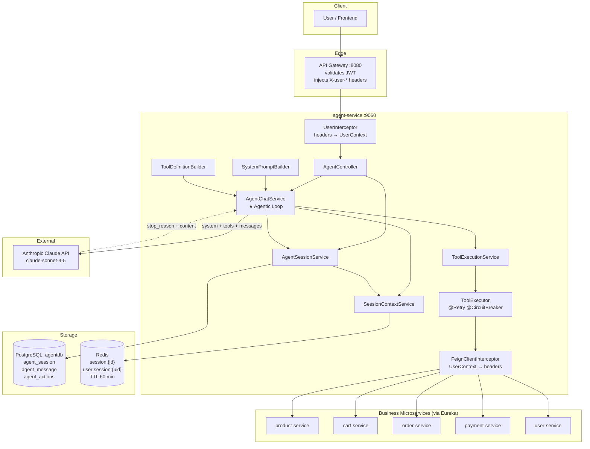
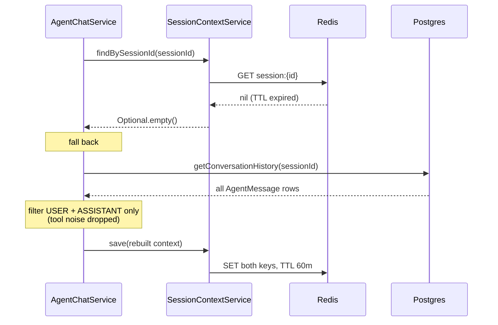
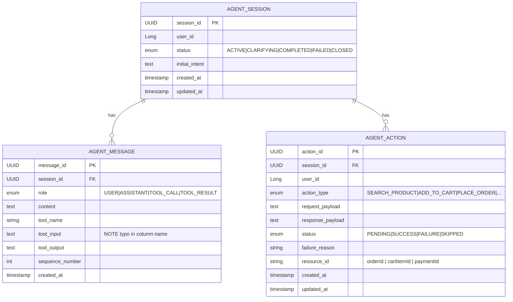
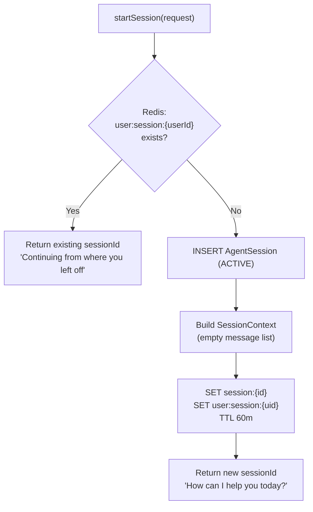
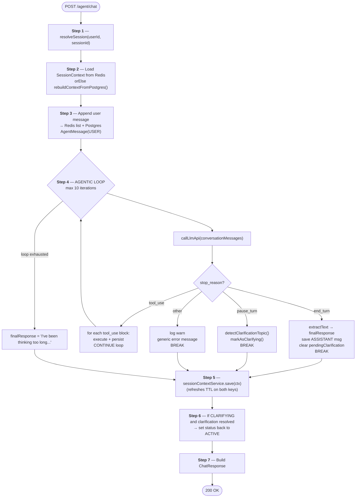
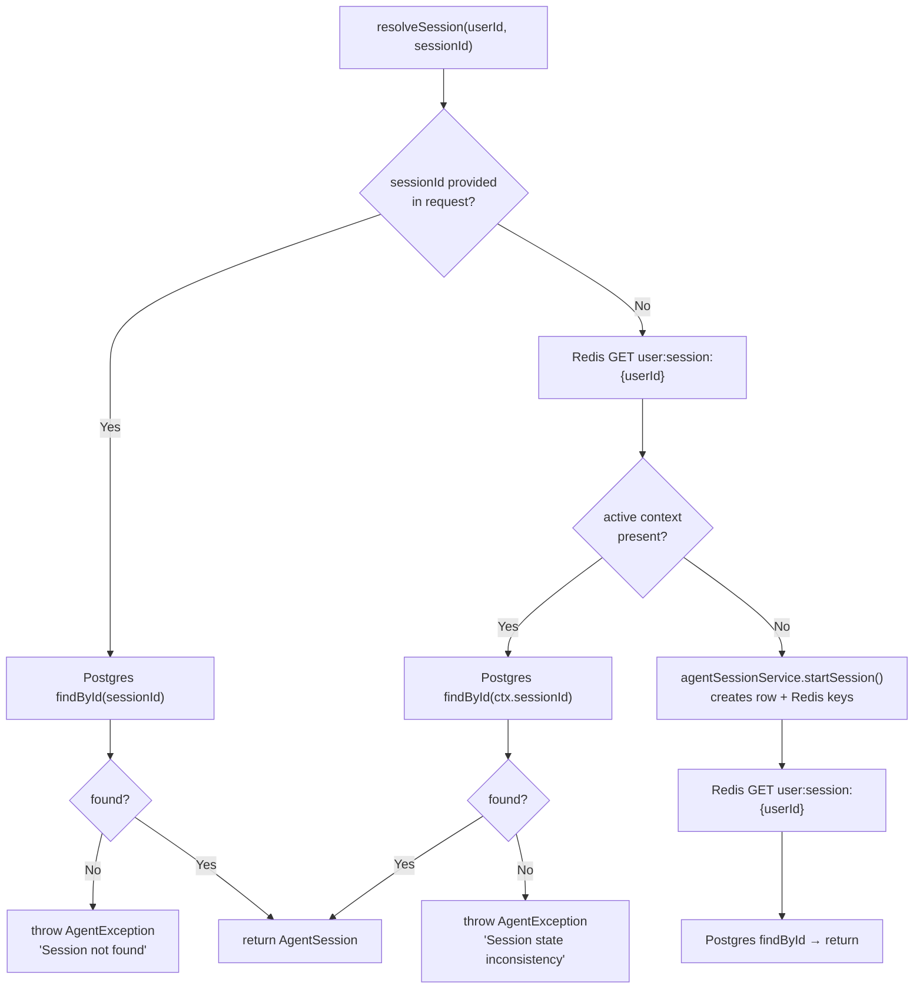
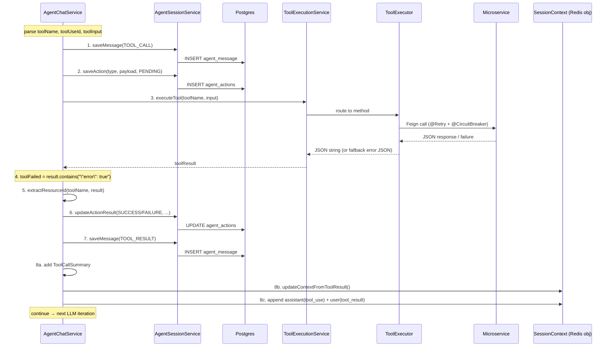
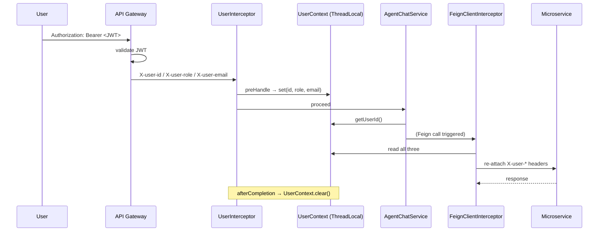
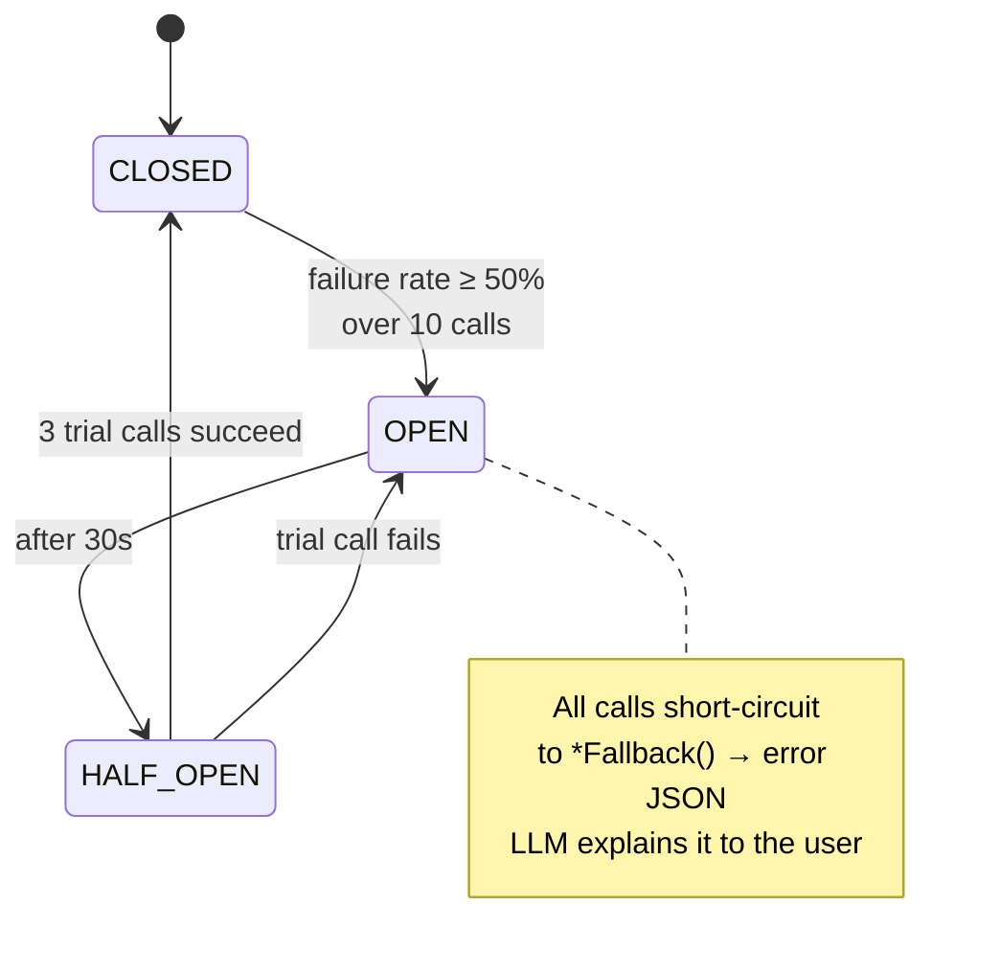
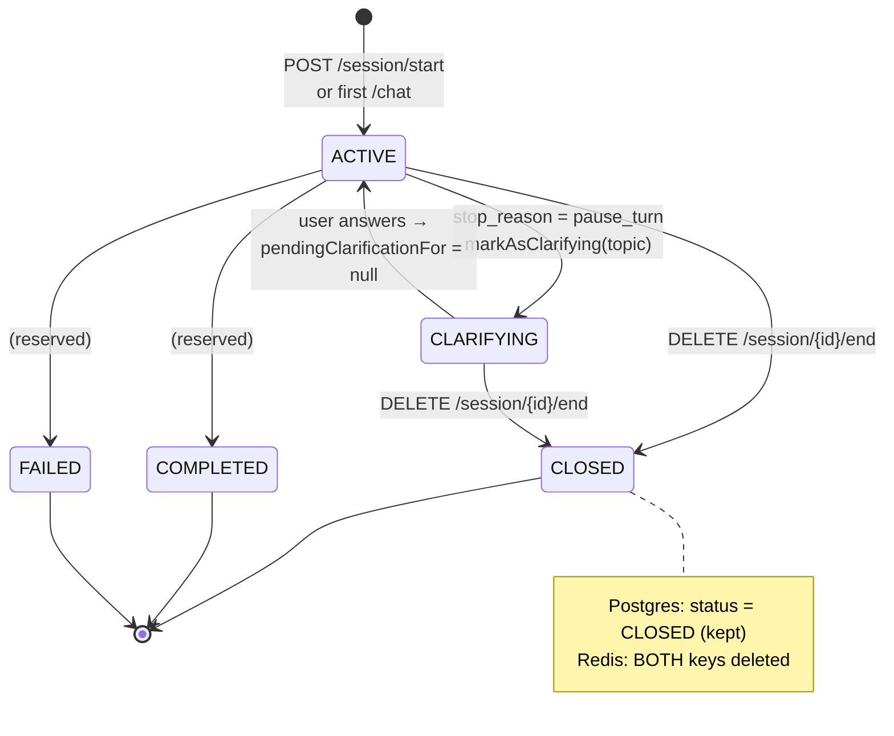

# Agent Service — Architecture & Data Flow

> Complete technical breakdown of `agent-service` — the AI orchestration brain of the platform.

---

## Table of Contents

1. [What This Service Actually Does](#1-what-this-service-actually-does)
2. [Package Structure (Layer Map)](#2-package-structure-layer-map)
3. [High-Level Architecture](#3-high-level-architecture)
4. [The Dual-Storage Model (Postgres vs Redis)](#4-the-dual-storage-model-postgres-vs-redis)
5. [Data Model](#5-data-model)
6. [API Catalog](#6-api-catalog)
7. [The Core Flow: `POST /agent/chat`](#7-the-core-flow-post-agentchat)
8. [The Agentic Loop (Deep Dive)](#8-the-agentic-loop-deep-dive)
9. [Tool Layer: Definition → Execution → Microservice](#9-tool-layer-definition--execution--microservice)
10. [Auth & Identity Propagation](#10-auth--identity-propagation)
11. [Resilience Strategy](#11-resilience-strategy)
12. [Session Lifecycle State Machine](#12-session-lifecycle-state-machine)
13. [End-to-End Worked Example](#13-end-to-end-worked-example)
14. [Configuration Reference](#14-configuration-reference)
15. [Known Issues & Improvement Backlog](#15-known-issues--improvement-backlog)

---

## 1. What This Service Actually Does

The agent-service is a **conversational orchestrator**. It sits between the user and your 5 business microservices.

```
User types:  "Buy me a black JBL speaker"
                        ↓
        agent-service converts natural language
        into a SEQUENCE of real API calls:
                        ↓
    searchProducts() → getProductDetails() → getVariantInfo()
         → getAllAddresses() → buyNow() → initiatePayment()
                        ↓
User sees:  "Order #1042 placed! Complete payment here."
```

**Three responsibilities:**

| Responsibility | Owned By |
|---|---|
| **Remember** the conversation | `SessionContextService` (Redis) + `AgentSessionService` (Postgres) |
| **Decide** what to do next | Claude LLM via `AgentChatService.callLlmApi()` |
| **Execute** the decision | `ToolExecutionService` → `ToolExecutor` → Feign clients |

---

## 2. Package Structure (Layer Map)

```
agent_service/
│
├── controller/              ← LAYER 1: HTTP entry point
│   └── AgentController          7 REST endpoints under /agent
│
├── service/                 ← LAYER 2: Business orchestration
│   ├── AgentChatService         ★ THE BRAIN — agentic loop, LLM calls
│   ├── AgentSessionService      Session CRUD + Postgres persistence
│   └── SessionContextService    Redis working-memory CRUD
│
├── llm/                     ← LAYER 3: LLM & tool machinery
│   ├── SystemPromptBuilder      Agent personality + behavior rules
│   ├── ToolDefinitionBuilder    JSON-schema of 12 tools sent to Claude
│   ├── ToolExecutionService     Router: toolName → ToolExecutor method
│   └── ToolExecutor             Resilience4j-wrapped Feign calls + fallbacks
│
├── clients/                 ← LAYER 4: Downstream microservices (Feign)
│   ├── ProductServiceClient     CartServiceClient
│   ├── OrderServiceClient       PaymentServiceClient
│   └── UserServiceClient
│
├── auth/                    ← CROSS-CUTTING: identity propagation
│   ├── UserInterceptor          Inbound  : headers → ThreadLocal
│   ├── UserContext              ThreadLocal store
│   ├── FeignClientInterceptor   Outbound : ThreadLocal → headers
│   └── WebConfig                Registers UserInterceptor
│
├── entity/ + repository/    ← PERSISTENCE (Postgres / JPA)
│   ├── AgentSession  ──1:N──> AgentMessage
│   └──                ──1:N──> AgentAction
│
├── model/                   ← REDIS MODELS (not JPA!)
│   ├── SessionContext           The agent's "working memory"
│   └── ConversationMessage      One turn in the conversation
│
├── dto/                     ← API CONTRACTS
│   ├── request/  ChatRequest, StartSessionRequest
│   ├── response/ ChatResponse, SessionStatusResponse, ...
│   └── summary/  ToolCallSummary, ActionSummary, SessionSummary
│
├── config/                  ← AppConfig (ModelMapper), RedisConfig (serializers)
├── common/                  ← ApiResponse<T>, ErrorResponse
└── exception/               ← 5 custom exceptions + GlobalExceptionHandler
```

---

## 3. High-Level Architecture



---

## 4. The Dual-Storage Model (Postgres vs Redis)

This is the **single most important concept** in this service. Two stores, two different jobs.

| | **PostgreSQL** | **Redis** |
|---|---|---|
| **Java type** | `AgentSession`, `AgentMessage`, `AgentAction` (`@Entity`) | `SessionContext`, `ConversationMessage` (POJO) |
| **Purpose** | Permanent **audit log** — "what happened, ever" | Hot **working memory** — "what the LLM needs right now" |
| **Lifetime** | Forever | 60 minutes TTL (`agent.session.ttl-minutes`) |
| **Keys** | `session_id` (UUID PK) | `session:{sessionId}` and `user:session:{userId}` |
| **Read by** | History/actions/status endpoints | Every single LLM call |
| **Written** | Every message + every tool action | End of each `/chat` turn |

### Why two Redis keys for the same object?

```
session:{sessionId}   → lookup by session   (used by /chat when sessionId is known)
user:session:{userId} → lookup by user      (used to find "does this user already have a live session?")
```

`SessionContextService.save()` writes the **same object to both keys**. `delete()` removes both.

### The self-healing path

If Redis expires but Postgres still has the data:



> **Note:** the rebuild deliberately drops `TOOL_CALL` / `TOOL_RESULT` rows — only human-readable turns are restored.

---

## 5. Data Model

### Postgres (audit / permanent)



**Message vs Action — what's the difference?**

- `AgentMessage` = **conversation transcript** (what was said/called, in order)
- `AgentAction` = **business event ledger** (what state change was attempted, and did it succeed)

A single tool call writes **3 rows**: one `TOOL_CALL` message, one `TOOL_RESULT` message, one `AgentAction`.

### Redis (working memory)

```java
SessionContext {
    UUID    sessionId;
    Long    userId;
    String  userEmail;

    List<ConversationMessage> conversationMessages;  // ← sent to Claude every turn

    String  currentIntent;
    String  pendingClarificationFor;   // "COLOR" | "SIZE" | "ADDRESS" | "CONFIRM_ORDER" | "QUANTITY"

    String  lastProductId;   // ← enables "make it black" without re-searching
    String  lastVariantId;
    String  lastOrderId;     // ← enables "where's my order?"
    LocalDateTime lastActivityAt;
}

ConversationMessage {
    String role;      // "user" | "assistant"
    String content;
    String toolName;  // null | actual tool name | "tool_result" (marker)
}
```

---

## 6. API Catalog

Base path: `/agent` · Port `9060` · All requests carry `X-user-id`, `X-user-role`, `X-user-email` (injected by gateway).

| # | Method | Path | Handler | Purpose |
|---|---|---|---|---|
| 1 | `POST` | `/agent/chat` | `AgentChatService.chat()` | ★ **Main endpoint** — send a message, agent thinks + acts |
| 2 | `POST` | `/agent/session/start` | `startSession()` | Explicitly open a session (idempotent) |
| 3 | `GET` | `/agent/session/{id}` | `getSessionStatus()` | Live status (merges Postgres + Redis) |
| 4 | `DELETE` | `/agent/session/{id}/end` | `endSession()` | Mark CLOSED + purge Redis |
| 5 | `GET` | `/agent/session/{id}/history` | `getConversationHistory()` | Full transcript incl. tool calls |
| 6 | `GET` | `/agent/session/my` | `getMySessions()` | All sessions + outcome strings |
| 7 | `GET` | `/agent/session/{id}/actions` | `getSessionActions()` | Business action audit trail |

All responses are wrapped:

```json
{
  "success": true,
  "message": "Chat processed",
  "data": { ... },
  "timestamp": "2026-08-29T10:15:30"
}
```

### 6.1 `POST /agent/chat`

**Request**
```json
{
  "sessionId": "3f8a...  (optional — omit on first message)",
  "message": "Add a black JBL speaker to my cart"
}
```

**Response (`ChatResponse`)**
```json
{
  "sessionId": "3f8a-...",
  "message": "I've added the JBL Flip 6 (Black) to your cart. Total: ₹8,999.",
  "sessionStatus": "ACTIVE",
  "clarificationNeeded": null,
  "quickReplies": null,
  "actionSummary": { "actionType": "ADD_TO_CART", "details": "Item added to your cart" },
  "toolCallsMade": [
    { "toolName": "searchProducts", "status": "SUCCESS", "description": "Found products matching your query" },
    { "toolName": "addToCart",      "status": "SUCCESS", "description": "Item added to cart" }
  ]
}
```

When the agent needs clarification:
```json
{
  "message": "Which color would you like — Black or Blue?",
  "sessionStatus": "CLARIFYING",
  "clarificationNeeded": "COLOR",
  "quickReplies": ["Black", "white", "Silver", "Other"]
}
```

### 6.2 `POST /agent/session/start` — Idempotency



### 6.3 `GET /agent/session/{id}` — Merged read

| Field | Source |
|---|---|
| `status`, `initialIntent`, `createdAt`, `updatedAt` | Postgres |
| `totalMessages`, `totalActions` | Postgres (COUNT) |
| `pendingClarificationFor`, `lastActivityAt`, `lastAgentMessage` | **Redis** (falls back gracefully if expired) |

### 6.4 `GET /agent/session/my` — Outcome derivation

```
if  any PLACE_ORDER/BUY_NOW action == SUCCESS  → "Order #{resourceId} placed successfully"
elif any INITIATE_PAYMENT action == SUCCESS    → "Payment initiated - awaiting completion"
else switch(session.status):
       COMPLETED  → "Completed Successfully"
       FAILED     → "Session failed - please try again"
       CLOSED     → "Session closed without completing"
       CLARIFYING → "Waiting for your response"
       default    → "In progress"
```

---

## 7. The Core Flow: `POST /agent/chat`

Seven steps inside `AgentChatService.chat()`:



### Step 1 detail — `resolveSession()`



**Why Postgres first when `sessionId` is given?** Because Redis stores `SessionContext`, **not** `AgentSession`. The entity only exists in Postgres. Redis is only consulted to *discover* a sessionId when the client didn't supply one.

---

## 8. The Agentic Loop (Deep Dive)

The loop is bounded by `MAX_TOOL_CALLS = 10` to prevent runaway LLM cycles.

### Request sent to Claude every iteration

```json
{
  "model": "claude-sonnet-4-5",
  "max_tokens": 1000,
  "system":   "<SystemPromptBuilder.build()>",
  "tools":    [ /* 12 tool schemas from ToolDefinitionBuilder */ ],
  "messages": [ /* full conversationMessages from Redis */ ]
}
```

Headers: `x-api-key`, `anthropic-version: 2023-06-01`, `Content-Type: application/json`.

### Branch A — `stop_reason: "tool_use"` (the interesting one)

For **each** `tool_use` content block, 8 things happen in order:



**`updateContextFromToolResult()` — the memory trick:**

| Tool | Stored in SessionContext | Why |
|---|---|---|
| `getProductDetails`, `searchProducts` | `lastProductId` | So *"make it black"* works without re-searching |
| `getVariantInfo` | `lastVariantId` | Follow-up stock/price questions |
| `placeOrder`, `buyNow` | `lastOrderId` | *"Where's my order?"* in the same session |

### Branch B — `stop_reason: "end_turn"`

Extract text → append ASSISTANT to Redis + Postgres → `pendingClarificationFor = null` → **break**.

### Branch C — `stop_reason: "pause_turn"`

Treated as *"agent needs clarification"*:

```
detectClarificationTopic(text)  ← keyword matching on the agent's own reply
    contains "color"/"colour"      → "COLOR"
    contains "size"                → "SIZE"
    contains "address"/"deliver"   → "ADDRESS"
    contains "confirm"/"proceed"   → "CONFIRM_ORDER"
    contains "quantity"/"how many" → "QUANTITY"
    else                           → "GENERAL"

→ markAsClarifying(sessionId, topic)   // Postgres status = CLARIFYING + Redis field
→ buildQuickReplies(topic)             // canned buttons for the UI
```

| Topic | Quick replies returned to frontend |
|---|---|
| `CONFIRM_ORDER` | Yes, confirm order · No cancel |
| `COLOR` | Black · white · Silver · Other |
| `SIZE` | Small · Medium · Large · XL |
| `QUANTITY` | 1 · 2 · 3 |
| `ADDRESS` | Use saved address · Add new address |
| `GENERAL` | `null` |

---

## 9. Tool Layer: Definition → Execution → Microservice

### The 3-stage pipeline

```
ToolDefinitionBuilder  →  tells Claude WHAT tools exist (JSON Schema)
ToolExecutionService   →  routes toolName to the right Java method + shapes the body
ToolExecutor           →  makes the resilient Feign call, returns raw JSON or error JSON
```

### Complete tool ↔ endpoint mapping

| Tool (exposed to LLM) | `ToolExecutor` method | Feign client → HTTP call | `ActionType` |
|---|---|---|---|
| `searchProducts` | `searchProducts(search, category)` | `GET product-service /products/all?search&category&page=0&size=10` | `SEARCH_PRODUCT` |
| `getProductDetails` | `getProductDetails(productId)` | `GET product-service /products/details/{productId}` | `GET_PRODUCT_DETAILS` |
| `getVariantInfo` | `getProductItemDetails(pid, vid)` | `GET product-service /products/{pid}/variants/{vid}/item-info` | `GET_VARIANT_INFO` |
| `getCart` | `getCart()` | `GET cart-service /cart` | *(unmapped → default)* |
| `addToCart` | `addToCart(body)` | `POST cart-service /cart/items` | `ADD_TO_CART` |
| `clearCart` | `clearCart()` | `DELETE cart-service /cart/clear` | `CLEAR_CART` |
| `placeOrder` | `placeOrder(body)` | `POST order-service /orders` | `PLACE_ORDER` |
| `buyNow` | `buyNow(body)` | `POST order-service /orders/buy-now` | `BUY_NOW` |
| `getOrder` | `getOrder(orderId)` | `GET order-service /orders/{orderId}` | `GET_ORDER_STATUS` |
| `getMyOrders` | `getMyOrders()` | `GET order-service /orders/my-orders` | `GET_ORDER_STATUS` |
| `initiatePayment` | `initiatePayment(body)` | `POST payment-service /payments/initiate` | `INITIATE_PAYMENT` |
| `getAllAddresses` | `getAllAddresses()` | `GET user-service /users/address/all` | `GET_USER_ADDRESS` |

> ✅ **Fixed:** `ToolDefinitionBuilder` advertises the tool as `getVariantInfo`, but the `switch` in `ToolExecutionService` used to match only `getProductItemDetails` — so every stock check fell into `default:` and returned `{"error": true, "message": "Unknown tool: getVariantInfo"}`. The case now matches both names. See [§15](#15-known-issues--improvement-backlog).

### Body construction

Most tools pass `input.toString()` straight through as the request body. `addToCart` is the exception — it is explicitly re-shaped:

```java
{"productId":%d,"variantId":%d,"quantity":%d}   // quantity defaults to 1
```

### Error envelope

Every failure path — unknown tool, exception, or circuit-breaker fallback — produces the same shape:

```json
{ "error": true, "tool": "addToCart", "message": "Unable to add item to cart right now. Please try again." }
```

This is **deliberate**: the JSON goes back into the conversation, so Claude *reads the failure* and explains it to the user in natural language instead of the request blowing up.

---

## 10. Auth & Identity Propagation

No JWT parsing happens here — the gateway already did that. The agent-service just relays identity.



> ⚠️ `UserContext.clear()` only calls `userId.remove()` — `userRole` and `userEmail` **leak across pooled threads**. See [§15](#15-known-issues--improvement-backlog).

---

## 11. Resilience Strategy

Two independent layers.

### Layer 1 — Resilience4j on every microservice call

```yaml
resilience4j:
  retry:
    instances:
      microservice-call:
        max-attempts: 3
        wait-duration: 500ms
        retry-exceptions: [feign.FeignException, java.io.IOException]
      llm-call:
        max-attempts: 2
        wait-duration: 2s
  circuitbreaker:
    instances:
      microservice-call:
        sliding-window-size: 10
        failure-rate-threshold: 50          # open if 50% of last 10 calls fail
        wait-duration-in-open-state: 30s    # then half-open
        permitted-number-of-calls-in-half-open-state: 3
        register-health-indicator: true
```



Every `ToolExecutor` method has a matching `xxxFallback(..., Exception ex)` returning a **user-friendly** message, e.g.:

> `initiatePaymentFallback` → *"Payment service is temporarily unavailable. Your order has been saved. Please try payment again."*

### Layer 2 — Loop guard

`MAX_TOOL_CALLS = 10`. If exhausted → *"I've been thinking too long. Could you please rephrase your request?"*

### Layer 3 — `GlobalExceptionHandler`

| Exception | HTTP status |
|---|---|
| `MethodArgumentNotValidException` | 400 |
| `BadRequestException` | 400 |
| `SessionNotFoundException` | 404 |
| `UnauthorizedSessionAccessException` | 403 |
| `AgentException` (LLM/session failures) | 500 |
| `ToolCallException` | 502 |
| `Exception` (catch-all) | 500 |

---

## 12. Session Lifecycle State Machine



> `COMPLETED` and `FAILED` exist in the enum and are handled in `buildOutcomeString()`, but **nothing currently transitions into them**.

---

## 13. End-to-End Worked Example

**User:** *"Buy me a black JBL speaker"* (no `sessionId` sent)

| # | Actor | What happens |
|---|---|---|
| 1 | Gateway | Validates JWT → `X-user-id: 42` |
| 2 | `UserInterceptor` | `UserContext.setUserId("42")` |
| 3 | `resolveSession` | No `sessionId` → Redis `user:session:42` miss → `startSession()` → new UUID + 2 Redis keys |
| 4 | `chat` Step 2 | Redis hit (just created), empty message list |
| 5 | `chat` Step 3 | Append `user` msg to Redis; INSERT `AgentMessage(USER, seq=0)` |
| 6 | **Loop #1** | Claude → `tool_use: searchProducts{search:"JBL speaker"}` |
| 7 | | INSERT `TOOL_CALL` msg + `AgentAction(SEARCH_PRODUCT, PENDING)` |
| 8 | | `GET /products/all?search=JBL speaker` → product list JSON |
| 9 | | UPDATE action → `SUCCESS`; INSERT `TOOL_RESULT` msg; push both blocks into Redis history |
| 10 | **Loop #2** | Claude → `tool_use: getProductDetails{productId:88}` → variants returned; `lastProductId = 88` |
| 11 | **Loop #3** | Claude → `pause_turn`: *"Which color — Black or Blue?"* |
| 12 | | `detectClarificationTopic` → `"COLOR"`; status → `CLARIFYING`; quick replies `[Black, white, Silver, Other]` |
| 13 | Step 5–7 | Redis saved (TTL reset), `ChatResponse` returned |
| 14 | **User** | *"Black"* (now **with** `sessionId`) |
| 15 | **Loop #1** | Claude → `getVariantInfo` → stock OK |
| 16 | **Loop #2** | Claude → `getAllAddresses` → address list |
| 17 | **Loop #3** | Claude → `buyNow{...}` → `orderId: 1042` → `lastOrderId = 1042`, `AgentAction.resourceId = 1042` |
| 18 | **Loop #4** | Claude → `initiatePayment{orderId:1042, amount:8999}` → Razorpay id |
| 19 | **Loop #5** | Claude → `end_turn`: *"Order #1042 placed! Complete payment here."* |
| 20 | Step 6 | `CLARIFYING` + no pending clarification → back to `ACTIVE` |
| 21 | Step 7 | `actionSummary = {ORDER_PLACED, "Your order has been placed successfully"}` |

---

## 14. Configuration Reference

```properties
spring.application.name=agent-service
server.port=9060

# Postgres
spring.datasource.url=jdbc:postgresql://localhost:5432/agentdb
spring.datasource.username=${DB_USERNAME}
spring.datasource.password=${DB_PASSWORD}
spring.jpa.hibernate.ddl-auto=update

# Redis
spring.data.redis.host=localhost
spring.data.redis.port=6379
spring.data.redis.timeout=2000
agent.session.ttl-minutes=60

# LLM
anthropic.url=${ANTHROPIC_URL}
anthropic.api.key=${ANTHROPIC_API_KEY}
anthropic.api.model=claude-sonnet-4-5
anthropic.api.max-tokens=1000

# Service discovery
eureka.client.service-url.defaultZone=http://localhost:8761/eureka
```

**Redis serialization** (`RedisConfig`): keys = `StringRedisSerializer`; values = `Jackson2JsonRedisSerializer<SessionContext>` with `JavaTimeModule` and `WRITE_DATES_AS_TIMESTAMPS` disabled → readable ISO dates, human-inspectable JSON in Redis.

---

## 15. Known Issues & Improvement Backlog

Found while tracing the code. Ordered by severity.

### ✅ Critical — FIXED

**1. `getVariantInfo` tool was unreachable** — *fixed*
`ToolDefinitionBuilder` advertises `getVariantInfo`, but `ToolExecutionService` switched on `getProductItemDetails`, so every stock check silently returned *"Unknown tool"*.

```java
// ToolExecutionService.executeTool()
case "getVariantInfo", "getProductItemDetails" -> toolExecutor.getProductItemDetails(
        input.path("productId").asLong(),
        input.path("variantId").asLong()
);
```
The old name is kept as an alias so any persisted history still resolves.

**2. `buildToolUseContent()` arguments were swapped** — *fixed*
`id` received the tool *name* and `name` received the *id*. The `input` placeholder was also quoted (`"input":"%s"`), which produced invalid JSON because `toolInput` is already an object.

```java
private String buildToolUseContent(String toolUseId, String toolName, String toolInput) {
    // toolInput is already a JSON object — embed it raw, not as a quoted string
    return String.format(
            "[{\"type\":\"tool_use\", \"id\":\"%s\", \"name\":\"%s\", \"input\":%s}]",
            toolUseId,
            toolName,
            toolInput
    );
}
```

**3. `resolveSession()` had no ownership check** — *fixed*
A supplied `sessionId` was loaded straight from Postgres without verifying the owner, so **any user could hijack any session** with a leaked UUID. It now mirrors `findAndValidateSession()` and also throws a proper `SessionNotFoundException` (404) instead of a generic `AgentException` (500).

```java
if (sessionId != null) {
    AgentSession session = agentSessionRepository.findById(sessionId)
            .orElseThrow(() -> new SessionNotFoundException(sessionId.toString()));

    // Make sure the caller actually owns this session
    if (!session.getUserId().equals(userId)) {
        log.warn("User {} attempted to access session {} owned by user {}",
                userId, sessionId, session.getUserId());
        throw new UnauthorizedSessionAccessException(sessionId.toString());
    }
    return session;
}
```

### 🟠 High — open

**4. Tool blocks are sent as JSON *strings*, not Anthropic content blocks**
`buildMessagesForApi()` puts a stringified array into `content`. The Anthropic API expects real `tool_use` / `tool_result` block objects. Claude currently "sees" tool results as plain text — it mostly works, but breaks strict tool-use correlation and is fragile with quotes/newlines.

**5. `TOOL_CALL` messages are saved with role `USER`**
```java
agentSessionService.saveMessage(session, MessageRole.USER, null, toolName, ...)
```
The `TOOL_CALL` enum value exists but is never used — history endpoints mislabel tool calls as user messages.

**6. `sequenceNumber` derived from `COUNT(*)`**
`saveMessage()` uses `countBySession_SessionId()` as the next sequence. Concurrent requests on the same session produce duplicate sequence numbers.
→ Use a DB sequence, or `MAX(sequence_number)+1` inside the transaction.

**7. `UserContext.clear()` is incomplete**
Only `userId.remove()`. `userRole` and `userEmail` persist on the pooled thread and leak into the next request.

### 🟡 Medium

**8. `refreshTTL()` is dead code** — the comment says *"called on every /chat request"* but it never is. (TTL is in fact reset by `save()` at Step 5, so behavior is correct — the method is just unused.)

**9. Failure detection by substring** — `toolResult.contains("\"error\": true")` breaks if a downstream service formats JSON without the space. → Parse with Jackson and read the `error` field.

**10. `pause_turn` is being misused** — in the Anthropic API `pause_turn` signals a long-running server-side tool, not "needs clarification". Clarification questions arrive as `end_turn`. In practice Branch C rarely fires, and clarification falls into Branch B (which *clears* `pendingClarificationFor`) — so `CLARIFYING` status and `quickReplies` may never activate.

**11. `getCart` has no `ActionType`** — falls through to `default -> ActionType.SEARCH_PRODUCT`, polluting the audit trail. Same for `updateCartItem`.

**12. `ActionSummary.resourceId` is never populated** — the field exists but `buildActionSummary()` only sets `actionType` and `details`.

**13. `HttpClient` created per LLM call** — `HttpClient.newHttpClient()` inside `callLlmApi()` allocates a new client (and thread pool) every iteration. → Make it a singleton `@Bean`.

**14. `llm-call` retry config is unused** — defined in `application.yml` but no `@Retry(name="llm-call")` annotation exists on `callLlmApi()`.

**15. Column typo** — `agent_message.toot_input` should be `tool_input`.

**16. Unbounded conversation growth** — `conversationMessages` grows without limit; long sessions will hit Claude's context window and inflate cost. → Add a sliding window or summarization.

**17. `getConversationHistory` throws raw `RuntimeException`** on empty history → becomes a generic 500 instead of a meaningful 404.

### 🟢 Low

**18.** Duplicate full `SessionContext` blob stored under two Redis keys — doubles memory. → Store the payload under `session:{id}` and only a pointer string under `user:session:{uid}`.
**19.** `buildQuickReplies()` accepts `agentMessage` but never uses it.
**20.** `buildToolDescription()` accepts `result` but never uses it.
**21.** Typos: `LLL_URL` → `LLM_URL`; `mapTooNameToActionType` → `mapToolNameToActionType`; `"electroincs"` in a tool description.
**22.** `UserServiceClient.getAddressByAddressId` uses `@RequestBody Long` on a `@GetMapping` — should be `@PathVariable`.


